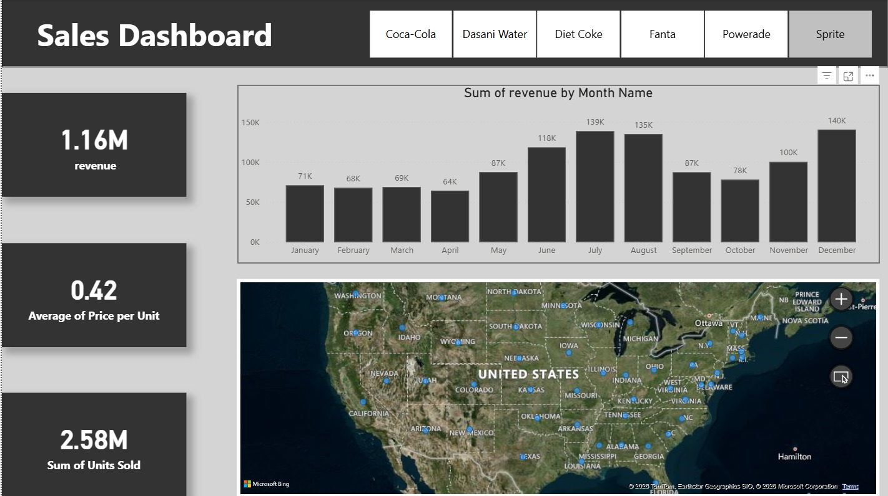

# 📊 Beverage Brand Sales Performance Dashboard

## 📌 Project Overview
This Power BI dashboard analyzes sales performance of multiple beverage brands across the United States. It provides insights into revenue, pricing, units sold, monthly trends, and regional distribution using interactive visuals.

---

## 🖥 Dashboard Structure (Top to Bottom)

### 1️⃣ Brand Slicer
Interactive slicer to filter data by:
- Coca-Cola
- Dasani Water
- Diet Coke
- Fanta
- Powerade
- Sprite

All visuals update dynamically based on brand selection.

---

### 2️⃣ Key Performance Indicators (KPIs)

**Total Revenue – 1.16M**  
Represents total sales revenue generated (SUM of Revenue).

**Average Price per Unit – 0.42**  
Shows the average selling price (AVERAGE of Price per Unit).

**Total Units Sold – 2.58M**  
Represents total quantity sold (SUM of Units Sold).

---

### 3️⃣ Monthly Revenue Trend
- Clustered Column Chart
- Shows Sum of Revenue by Month
- Helps identify seasonal and peak sales periods

---

### 4️⃣ Regional Sales Map
- Map visualization by State
- Displays revenue distribution across the U.S.
- Zoom-enabled for detailed regional analysis

---

## 🛠 Tools Used
- Power BI
- DAX (SUM, AVERAGE)
- Data Modeling
- Interactive Filters
- Geographic Visualization

---

## 📂 Dataset Fields
- Beverage Brand
- Date
- Month
- State
- Region
- Retailer
- Units Sold
- Price per Unit
- Revenue

---

## 📷 Dashboard Preview

---

## 🚀 Project Outcome

Through this project, the following outcomes were achieved:

- Developed an interactive Power BI dashboard for real-time sales analysis.
- Created dynamic KPI cards to monitor revenue, units sold, and pricing performance.
- Performed monthly trend analysis to identify seasonal sales patterns.
- Implemented brand-level filtering using slicers for comparative analysis.
- Designed a geographic sales map to highlight high-performing regions.
- Applied DAX functions (SUM, AVERAGE) for accurate metric calculations.
- Improved skills in data modeling and relationship management.
- Transformed raw sales data into actionable business insights.
- Demonstrated the ability to present data in a clear and decision-friendly format.
